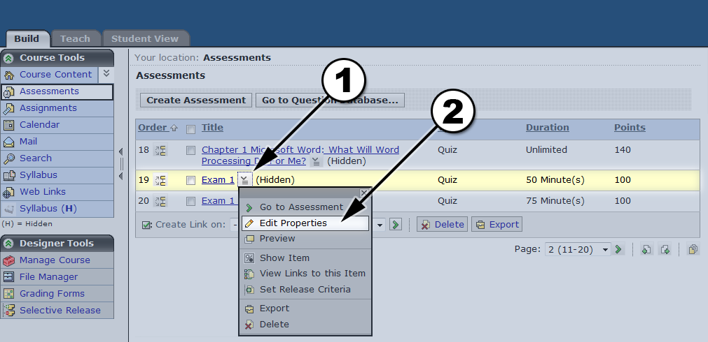
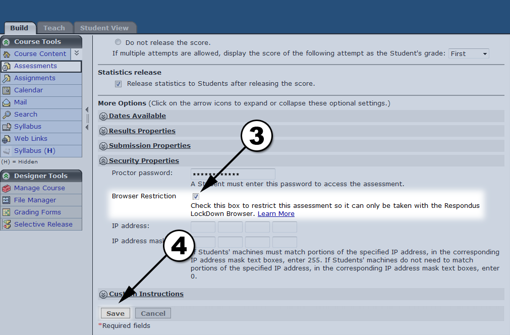

# Taking COMP1000 exams
## Rules
*	Exams are only available in the COMP1000 lab on provided machines.
*	You may not use your personal machine or complete exams from home.
*	Exams are open book, closed computer.
	*	Bring your book  for exams
	
## Instructions
1.	To take exams please click the Respondus Lockdown icon on your desktop
2.	Type in Auburn.edu in the address bar and continue to Blackboard.

# Need help studying for exams?
To help you study for tests multiple practice tests are made available.  To find practice tests please click through the following link path from your courses BlackBoard home screen: Student Resources > Extra Resources and various tests can be found.

# Setting up Lockdown Exams
 

Before using this guide please ensure that you are in the "Build" tab and viewing the Assessment page.
1.	To secure an exam start by clicking the "__Icon__" next to its name
2.	Click the "__Edit Properties__" link in the resulting popup
3.	Open the "__Security__" link and make sure that "__Browser Restriction__" is checked
4.	Press the "__Save__" button

# Need respondus?
[Download link, PC & Mac](http://www.respondus.com/lockdown/information.pl?ID=313412015)